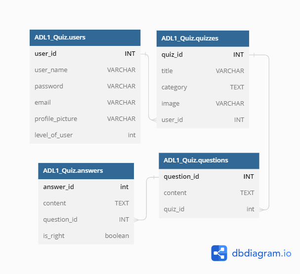

## System Design
========
## Introduction
In recent years, with the development of the Internet, the application of network technology has been deepened, web page production and website construction
have become more and more popular, and various web pages and website construction software have emerged one after another.

A webpage is a window for displaying news on the Internet.

Whether the webpage is made and designed exquisitely, whether it is rich in content, and whether it is easy to operate is the main factor that attracts users.

Web page design and production is one of the basic skills that need to be mastered when reading news online.

__Project name__ : **Quiz App**

## Overview
The team is using html to develop a web page where users can log in and register.

A high level summary that every engineer at the company should understand and use to decide if it's useful for them to read the rest of the doc. 

It should be 3 paragraphs max. We will create a useful system design and help our teammate understand how this program usually work ,and we will make this document as helpful as we can.

## Goal
Getting used to working in a project is one of the most important steps that a person should take when they start working in the software industry. There are a variety of tools that can help them manage their projects, such as Git, Trello, and GitLab.

The goal of this program is to provide participants with the necessary skills to succeed in today's volatile world, where technology is constantly improving and constantly changing. It will also help them make the life of their admin easier.

We also want to make sure that the application is not only about the manipulation of the experience, but also the ease of use of the website. This is because if a user enjoys the design and is able to navigate the site easily, it can be considered a success.

The team members must work together to make sure that the application can demonstrate their skills in data manipulation and provide an enjoyable and easy-to-use experience. They should also show how they can work as a team.

## Context
Everyone at this time has the required knowledge to make this project work, we would like to see all pages implemented at the end of November and having all the functionality at the first of December.

Any remaining time can be spent on making the website look better.

Main causes for concern would be to get the full working application out as soon as possible to comply with deadlines and get our grades.

The appearance of the website can be changed as the team feels.

## Design
Page planning: Front presentation: home page, about page, search, register, login.

Home page would contain some description.

About page would describe something in detail.

Register page will help user register in the website.

Login page will help user login into this page.

And we will use a random database to finish this program.

## DataBase Design

## Architectural plan
The application's design is created via HTML and CSS. 
The HTML contains wrapper classes and classes have boxes where user can type username and password into it and
there are also some buttons which can share this website to other friends.
then we have some taps which show user different topics of other information As it is a static webpage ,you can do fresh which can fresh the whole webpage.

## Functionality:
First page will be a well designed home page, from which the user can access the features of the website, but the user should login or create an account in order to access all of the features.

After which the user will be able to do what they are allowed to, as there would be different levels of a user. Editing would be accessible only to the highest levels, while taking quizzes would be accessible to all of the accounts. 

## Testing Plan
during test strategy, we need to test every function one by one,including system testing the tester should have the ability to understand customers point of view, then we should test the whole program, the goal is to test the whole program to see what will happen, if anything unexpected occurs, then we need to fix them.

## TDD
Test strategy is that, we should test every function one by one ,
including system testing the tester should have the ability to understand user point of view,then we should test the whole program,
the goal is that what basic thing user want from our App, is firstly the ability to access and complete quizzes ,
so we test if the user can access and complete them and also if the special users can edit them, and we test database so that user can easily sign up and then can sign in without any trouble,
for testing the registration system we give wrong information, and if it gives us a pass, we need to fix it.

## current situation
As the world gets more and more information, it needs to move along with it by creating multiple interactive ways of helping people remember information and check their knowledge, 
and so we have the idea to create an application that will make it very easy for the user to fulfill those human needs,
we have decided how the project should look like and we have got a team of 3 people who will be working on it.

## Functional design
Login button - by clicking this button the web site will log the user in.

Search button - this function will work to find the available quizzes that the user searched for. 

SignUp button - this function will help the user to sign up. 

Add button - this function will allow special users to create tables.

## Maintenance Plan
Since the interface was designed to be as dynamic as possible, the only part of the web that could require maintenance is the data API itself. This information can easily be changed by adjusting a single variable in the code,our teammate will do the mainly maintenance and fix bug.

## Open Questions
Any open issues that you aren't sure about, contentious decisions that you'd like readers to weigh in on, suggested future work, and so on.

A tongue-in-cheek name for this section is the 'known unknowns'.

we would like to welcome any suggestion that can improve our working environment and the webpage design.

## User Case Diagram

 

## Summary
For the success of this system we will rely mostly on peer programming to minimize the errors that programmers may have.

Our main focus will be on creating a user-friendly system that does not discriminate against gender, race, age, ethnic group and so on so our design will be highly maintained by allowing users to send emails should they wish to make comments or complaints about the design.